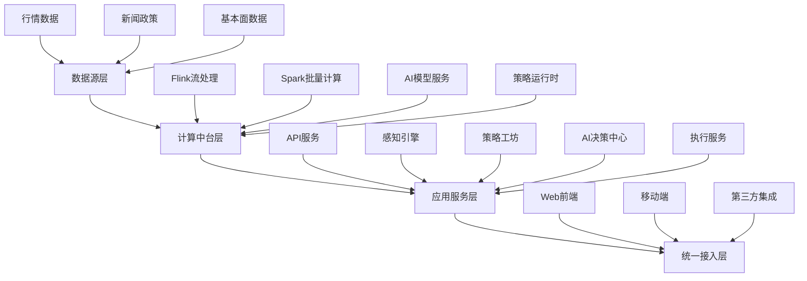

# QuantSaaS

[](https://golang.org)
[](https://docker.com)
[](https://kubernetes.io)

> 基于感知-决策智能的量化策略平台，实现量化投资的"技术民主化"

## 🌟 什么是QuantSaaS？

QuantSaaS 是首个将**宏观政策感知**、**AI辅助决策**与**用户自主创造**深度融合的量化策略SaaS平台。

通过先进的NLP技术和机器学习算法，我们将非结构化的新闻政策信息转化为可量化的投资因子，为投资者提供机构级的策略研究能力。

## ✨ 核心价值

### 🎯 技术民主化
让机构级的量化投资能力惠及更广泛的专业投资者

### 🤖 AI + 人工协同
AI负责数据分析和策略建议，人负责最终决策和风险控制

### 📊 全链路服务
从数据感知 → 策略构建 → 回测验证 → 实盘执行的完整闭环

## 🚀 核心功能

| 模块 | 功能特色 | 技术亮点 |
|------|----------|----------|
| 📰 新闻政策感知 | 多源数据接入、情感分析、事件提取 | NLP + 图谱算法 |
| 🏭 策略工坊 | AI生成策略、模板超市、代码IDE | 三层架构设计 |
| 🤖 AI决策中心 | 策略优化、行业轮动、归因分析 | 机器学习驱动 |
| ⚡ 智能执行 | 合规检查、个性化风控、自动执行 | 实时监控系统 |

## 🏗️ 技术架构



## 💼 商业模式

### Freemium 订阅体系
- **免费版**：基础功能体验
- **专业版**：$199/月，全量数据和高级功能
- **机构版**：定制化私有部署

### 增值服务
- 📊 **数据超市**：第三方特色数据购买
- 🤝 **策略托管**：优秀策略分享与跟投
- 👨‍💼 **专家咨询**：量化专家一对一服务

## 🛠️ 技术栈

| 组件 | 技术选择 | 版本要求 |
|------|----------|----------|
| 后端框架 | go-zero | 1.6.4+ |
| 编程语言 | Go | 1.22+ |
| 数据库 | MySQL | 8.0+ |
| 缓存 | Redis | 6.0+ |
| 消息队列 | Apache Pulsar | 2.10+ |
| 容器化 | Docker | 20.0+ |
| 编排 | Kubernetes | 1.24+ |

## 🚀 快速开始

### 环境要求
- Go 1.22+
- Docker & Docker Compose
- Git

### 一键启动（推荐）
```bash
# 克隆项目
git clone https://github.com/tal-tech/quantos.git
cd quantos

# 启动开发环境
make dev

# 执行数据库迁移
make migrate-up

# 查看服务状态
curl http://localhost:8888/health
```

### 手动部署
```bash
# 安装依赖
go mod download

# 启动基础设施
docker run -d --name mysql -e MYSQL_ROOT_PASSWORD=quantos123 -p 3306:3306 mysql:8.0
docker run -d --name redis -p 6379:6379 redis:7-alpine

# 初始化数据库
go run app/command/console.go migrate up

# 启动服务
go run app/api/api.go -f app/api/etc/api.yaml
```

## 📖 使用示例

### 用户注册
```bash
curl -X POST http://localhost:8888/api/v1/user/register \
  -H "Content-Type: application/json" \
  -d '{
    "username": "quant_trader",
    "email": "trader@tal.com",
    "password": "secure_password"
  }'
```

### 策略创建
```bash
curl -X POST http://localhost:8888/api/v1/strategies \
  -H "Authorization: Bearer YOUR_JWT_TOKEN" \
  -H "Content-Type: application/json" \
  -d '{
    "name": "新能源轮动策略",
    "description": "基于政策情感的行业轮动策略",
    "type": 2
  }'
```

## 📈 发展路线

### 已完成 ✅
- [x] 基础架构搭建 (go-zero微服务框架)
- [x] 用户管理系统和权限控制
- [x] 数据模型设计和数据库迁移
- [x] Docker/K8s部署配置
- [x] API服务和基础业务逻辑

### 进行中 🟡
- [ ] 新闻政策感知引擎 (NLP情感分析)
- [ ] 策略工坊 (AI策略生成)
- [ ] 实时数据处理管道

### 规划中 🟠
- [ ] AI决策中心 (机器学习优化)
- [ ] 智能风控系统 (实时监控)
- [ ] 移动端应用开发

## 🤝 贡献指南

我们欢迎各种形式的贡献！

### 开发贡献
1. Fork 本项目
2. 创建特性分支: `git checkout -b feature/amazing-feature`
3. 提交更改: `git commit -m 'Add amazing feature'`
4. 推送分支: `git push origin feature/amazing-feature`
5. 发起 Pull Request

### 其他贡献
- 🐛 问题反馈和bug报告
- 💡 功能建议和新想法
- 📖 文档改进和翻译
- 🎨 UI/UX设计建议

## 📄 许可证

本项目采用 MIT 许可证 - 详见 [LICENSE](LICENSE) 文件

## 📞 联系我们

- **官方网站**: https://quantos.tal.com
- **技术文档**: https://docs.tal.com/quantos
- **GitHub**: https://github.com/tal-tech/quantos
- **邮箱**: quantos@tal.com
- **内部论坛**: https://forum.tal.com/c/quantos

### 团队成员

- **项目负责人**: 张凌宇 (zhanglingyu@tal.com)
- **技术负责人**: 量化策略团队
- **商务合作**: business@tal.com

---

<p align="center">
  <strong>让量化投资不再是少数人的游戏</strong><br>
  <em>QuantSaaS - 量化投资的未来</em>
</p>

<p align="center">
  
  
  
</p>
